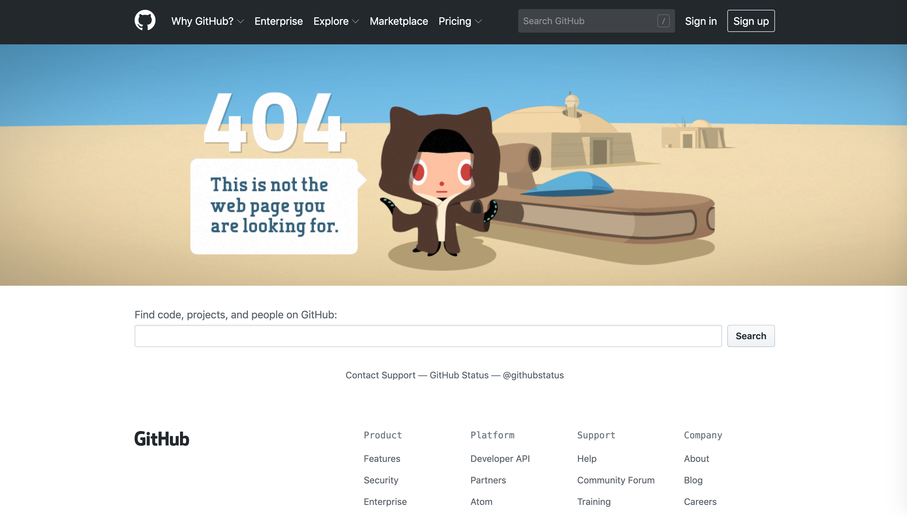
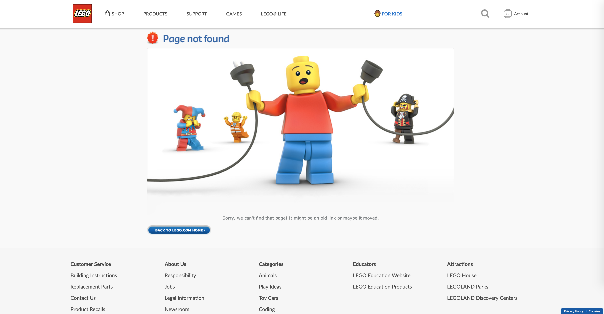
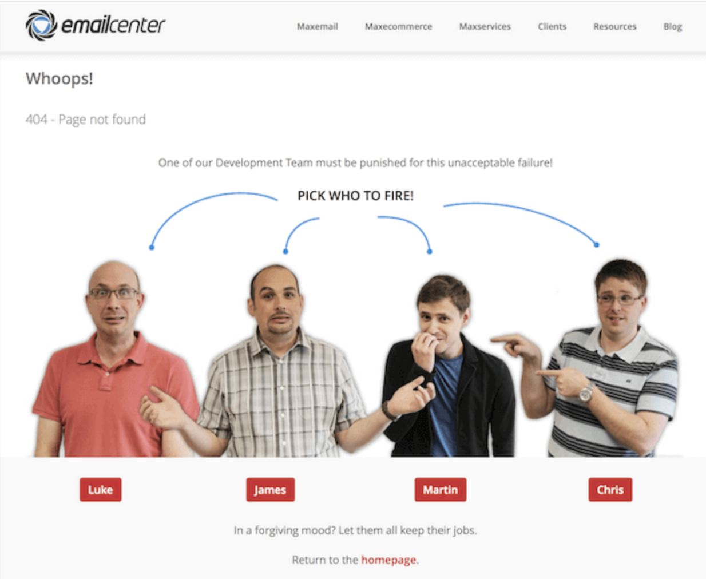

# Awesome 404 Not Found

> PRs are Welcome!

## Github

[Link](https://github.com/404)

## Android

[Link](https://www.android.com/404/)

## Slack

[Link](https://slack.com/404)

## Lego

[Link](https://www.lego.com/404)

## Email Center UK

~~[Link](https://www.emailcenteruk.com/404)~~ INVALID
